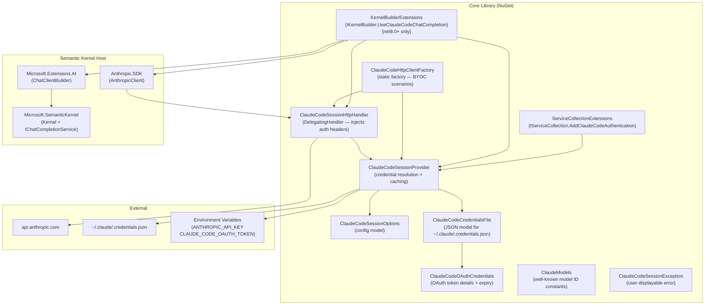
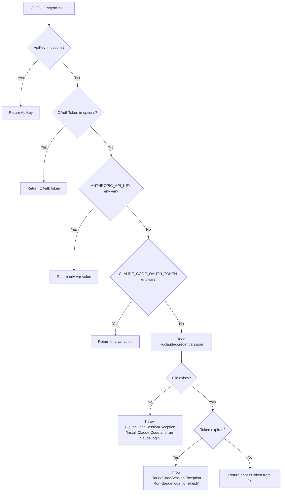
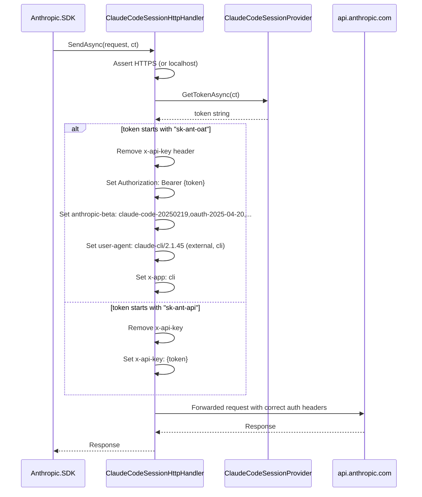

# Architecture

## Overview

The repository is organized as a **single-library + samples** monorepo. The core
`JD.SemanticKernel.Connectors.ClaudeCode` library is an authentication/integration shim sitting
between Anthropic's API and Microsoft Semantic Kernel. The sample CLI tools build on top of it to
demonstrate practical agentic workflows.

---

## High-Level Component Diagram



---

## Credential Resolution Flow



---

## HTTP Request Authentication Flow



---

## DI Integration Architecture

### Path 1 — `UseClaudeCodeChatCompletion()` (net8.0+ only)

This is the **simplest path**, requiring only one method call. It bypasses the DI container entirely
and wires up the complete authentication → HTTP → Anthropic SDK → Semantic Kernel chain internally.

```
IKernelBuilder
  └── UseClaudeCodeChatCompletion(modelId, apiKey?, configure?)
        ├── new ClaudeCodeSessionOptions()
        ├── new ClaudeCodeSessionProvider(Options.Create(options), NullLogger)
        ├── new HttpClient(new ClaudeCodeSessionHttpHandler(provider))
        ├── new AnthropicClient("placeholder", httpClient)
        ├── ChatClientBuilder(anthropicClient.Messages)
        │     .ConfigureOptions(o => o.ModelId ??= modelId)
        │     .UseFunctionInvocation()
        │     .Build()
        └── builder.Services.AddSingleton<IChatCompletionService>(chatClient.AsChatCompletionService())
```

> **Note:** `KernelBuilderExtensions.cs` is wrapped in `#if !NETSTANDARD2_0`, so it is **not
> compiled** for the `netstandard2.0` target. For netstandard2.0 hosts, use the
> `ServiceCollectionExtensions` + `ClaudeCodeHttpClientFactory` path instead.

### Path 2 — `AddClaudeCodeAuthentication()` (all TFMs)

For ASP.NET Core or Generic Host applications. Registers `ClaudeCodeSessionProvider` as a
singleton in the DI container. You then construct `ClaudeCodeSessionHttpHandler` and your
Anthropic SDK client manually, or use `ClaudeCodeHttpClientFactory.Create(provider)`.

```
IServiceCollection
  ├── Configure<ClaudeCodeSessionOptions>(...)      ← from delegate or IConfiguration
  └── AddSingleton<ClaudeCodeSessionProvider>()
```

### Path 3 — `ClaudeCodeHttpClientFactory.Create()` (all TFMs, no DI)

Standalone static factory for console apps or scenarios without a DI container. Returns a
fully-configured `HttpClient`. The caller is responsible for disposing it.

---

## Sample Tools Architecture

Each sample tool follows the same pattern:

```
Program.cs (System.CommandLine root command)
  ├── Parse CLI arguments
  ├── Kernel.CreateBuilder()
  │     ├── .UseClaudeCodeChatCompletion(model)
  │     └── .Plugins.AddFromObject(...)   ← domain-specific SK plugins
  ├── kernel.Build()
  ├── ChatHistory  ← system prompt + user message
  └── chat.GetChatMessageContentAsync(history, settings, kernel, ct)
        └── FunctionChoiceBehavior.Auto()  ← agentic tool-use loop
```

### CodebaseExplorer (`jdxplr`)

Agentic codebase profiler. Exposes three SK plugin groups to the LLM:

| Plugin Class | SK Group Name | Capabilities |
|---|---|---|
| `FileSystemPlugin` | `FileSystem` | Directory tree, file read, line counts, file search |
| `CodeAnalysisPlugin` | `CodeAnalysis` | .csproj analysis, namespace extraction, pattern search, entry points |
| `KnowledgeBaseWriterPlugin` | `KnowledgeBase` | Write/append/list markdown documents |

### GherkinGenerator (`jdgerkinator`)

Acceptance criteria → Gherkin feature file generator. Supports interactive REPL and file input.

| Plugin Class | SK Group Name | Capabilities |
|---|---|---|
| `StepDefinitionScannerPlugin` | `StepScanner` | Scan .NET assemblies for Reqnroll/SpecFlow step defs (MetadataLoadContext) |
| `FeatureFilePlugin` | `Features` | Read/list existing .feature files |
| `GherkinWriterPlugin` | `GherkinWriter` | Write .feature files to output directory |

### PullRequestReviewer (`jdpr`)

Multi-provider AI code review agent. Runs an analyzer pipeline before handing off to the LLM.

```
Provider Selection (--provider flag)
  ├── GitHub  → GitHubPullRequestProvider (Octokit)
  ├── ADO     → AzureDevOpsPullRequestProvider (HttpClient + REST)
  └── GitLab  → GitLabPullRequestProvider (HttpClient + REST)
         ↓
PullRequestInfo (normalized cross-platform PR model)
         ↓
IAnalyzer pipeline (extensible)
  └── DiffAnalyzer  → detects large diffs, high churn, secrets, TODOs, deleted tests
         ↓
SK Kernel with CodeReviewPlugin + GitPlugin
         ↓
Structured review with severity counts + verdict
  (Approve / RequestChanges / Comment)
```

---

## Data Models

### Core Library

```
ClaudeCodeSessionOptions        ← configuration input
    .ApiKey?                    ← explicit override
    .OAuthToken?                ← explicit OAuth override
    .CredentialsPath?           ← custom path to credentials file

ClaudeCodeCredentialsFile       ← JSON root of ~/.claude/.credentials.json
    .ClaudeAiOauth?             → ClaudeCodeOAuthCredentials

ClaudeCodeOAuthCredentials      ← deserialized OAuth token data
    .AccessToken
    .RefreshToken
    .ExpiresAt                  ← Unix epoch ms
    .Scopes[]
    .SubscriptionType?
    .RateLimitTier?
    .ExpiresAtUtc               ← computed DateTimeOffset
    .IsExpired                  ← computed bool
```

### PullRequestReviewer Abstractions

```
PullRequestInfo
    .Number / .Title / .Description / .Author
    .SourceBranch / .TargetBranch
    .Files: IReadOnlyList<FileChange>
    .CloneUrl?

FileChange
    .Path / .ChangeType / .Diff / .PreviousPath?
    .Additions / .Deletions

AnalyzerResult
    .AnalyzerName
    .Findings: IReadOnlyList<AnalyzerFinding>
    .RawOutput?

AnalyzerFinding(FilePath, LineNumber?, Severity, Message)

ReviewComment
    .FilePath / .LineNumber? / .Severity / .Category
    .Body / .SuggestedFix?
```

---

## Security Considerations

- `ClaudeCodeSessionHttpHandler` **enforces HTTPS** for all outbound requests (localhost is
  exempted for testing). Any non-HTTPS target throws `InvalidOperationException`.
- `FileSystemPlugin` in CodebaseExplorer enforces a **path traversal guard** — all file reads are
  validated to remain within the configured codebase root.
- `KnowledgeBaseWriterPlugin` enforces a **path traversal guard** — all writes are validated to
  remain within the configured output directory (`UnauthorizedAccessException` on violation).
- OAuth tokens are **never logged** — only expiry time and tier metadata are emitted to the logger.
- The `ClaudeCodeSessionProvider` credential cache uses a `SemaphoreSlim` with double-checked
  locking to prevent duplicate file reads under concurrent load.
