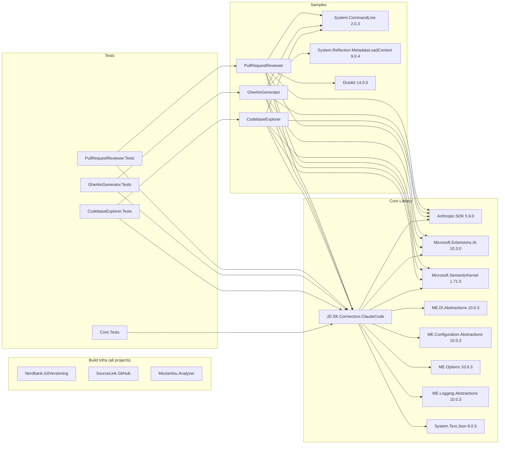

# Dependencies

All package versions are centrally managed via `Directory.Packages.props` (Central Package
Management). Individual project files reference packages **without** version attributes; versions
are the single source of truth in `Directory.Packages.props`.

---

## Core Library — `JD.SemanticKernel.Connectors.ClaudeCode`

| Package | Version | Purpose |
|---------|---------|---------|
| `Anthropic.SDK` | 5.9.0 | Official Anthropic .NET SDK; provides `AnthropicClient` and message models |
| `Microsoft.Extensions.AI` | 10.3.0 | `IChatClient`, `ChatClientBuilder`, `UseFunctionInvocation()` — bridges Anthropic SDK to SK |
| `Microsoft.SemanticKernel` | 1.71.0 | Core Semantic Kernel: `IKernelBuilder`, `IChatCompletionService`, plugin framework |
| `Microsoft.Extensions.DependencyInjection.Abstractions` | 10.0.3 | `IServiceCollection` extension method signature |
| `Microsoft.Extensions.Configuration.Abstractions` | 10.0.3 | `IConfiguration` overload for `AddClaudeCodeAuthentication` |
| `Microsoft.Extensions.Options` | 10.0.3 | `IOptions<T>`, `Options.Create()` for options pattern |
| `Microsoft.Extensions.Options.ConfigurationExtensions` | 10.0.3 | `services.Configure<T>(IConfiguration)` binding |
| `Microsoft.Extensions.Logging.Abstractions` | 10.0.3 | `ILogger<T>`, `NullLogger` — zero-alloc logging |
| `System.Text.Json` | 8.0.5 | JSON deserialization of `~/.claude/.credentials.json`; pinned to 8.0.5 for netstandard2.0 compat |

> **Design note:** All `Microsoft.Extensions.*` packages are **abstractions only** — the library
> has no concrete dependency on `Microsoft.Extensions.Logging` or any specific DI container,
> keeping it host-agnostic.

---

## Sample — CodebaseExplorer

| Package | Version | Purpose |
|---------|---------|---------|
| `Microsoft.SemanticKernel` | 1.71.0 | Kernel, plugin framework, chat completion |
| `Microsoft.Extensions.AI` | 10.3.0 | Function invocation pipeline |
| `Anthropic.SDK` | 5.9.0 | Underlying Anthropic HTTP client |
| `System.CommandLine` | 2.0.3 | Modern CLI argument parsing |

**Project reference:** `src/JD.SemanticKernel.Connectors.ClaudeCode`

---

## Sample — GherkinGenerator

| Package | Version | Purpose |
|---------|---------|---------|
| `Microsoft.SemanticKernel` | 1.71.0 | Kernel, plugin framework |
| `Microsoft.Extensions.AI` | 10.3.0 | Function invocation pipeline |
| `Anthropic.SDK` | 5.9.0 | Underlying Anthropic HTTP client |
| `System.CommandLine` | 2.0.3 | CLI argument parsing |
| `System.Reflection.MetadataLoadContext` | 9.0.4 | Reflection-only assembly loading for scanning Reqnroll/SpecFlow step definitions without loading them into the live runtime |

**Project reference:** `src/JD.SemanticKernel.Connectors.ClaudeCode`

---

## Sample — PullRequestReviewer

| Package | Version | Purpose |
|---------|---------|---------|
| `Microsoft.SemanticKernel` | 1.71.0 | Kernel, plugin framework |
| `Microsoft.Extensions.AI` | 10.3.0 | Function invocation pipeline |
| `Anthropic.SDK` | 5.9.0 | Underlying Anthropic HTTP client |
| `System.CommandLine` | 2.0.3 | CLI argument parsing |
| `Octokit` | 14.0.0 | GitHub REST API client for PR data retrieval |

> **Note:** Azure DevOps and GitLab providers are implemented directly over raw `HttpClient`
> calls rather than using SDK packages, keeping dependencies minimal.

**Project reference:** `src/JD.SemanticKernel.Connectors.ClaudeCode`

---

## Test Projects

All four test projects share the same testing infrastructure:

| Package | Version | Purpose |
|---------|---------|---------|
| `xunit` | 2.5.3 | Test framework |
| `xunit.runner.visualstudio` | 2.5.3 | VS / `dotnet test` runner integration |
| `Microsoft.NET.Test.Sdk` | 17.14.1 | MSBuild test SDK |
| `coverlet.collector` | 6.0.0 | Code coverage collection |
| `Xunit.SkippableFact` | 1.4.13 | `[SkippableFact]` / `[SkippableTheory]` for live integration tests that require real credentials |

The **core library test project** additionally uses:
- `Microsoft.Extensions.Configuration` 10.0.3 — building in-memory `IConfiguration` for binding tests
- `Microsoft.Extensions.Logging` 10.0.3 — concrete logging for integration tests

---

## Build Infrastructure (all projects, via `Directory.Build.props`)

| Package | Version | Purpose |
|---------|---------|---------|
| `Nerdbank.GitVersioning` | 3.7.115 | Git-based semantic versioning; version computed from `version.json` + git height |
| `Microsoft.SourceLink.GitHub` | 8.0.0 | Embeds source links in PDB/symbol packages for debugging |
| `Meziantou.Analyzer` | 2.0.187 | Roslyn analyzer with opinionated code quality rules (enforced as build errors) |

---

## Dependency Graph



---

## Version Management

Versions are **not pinned** in individual `.csproj` files; they are resolved centrally:

```
Directory.Packages.props    ← authoritative version for every package
Directory.Build.props       ← references Nerdbank.GitVersioning + SourceLink + Meziantou
version.json                ← version prefix "0.1", git-height suffix applied automatically
```

This means:
- Running `dotnet build` on `main` branch produces version `0.1.{height}`.
- Publishing from a `v*` tag produces a clean release version.
- All packages are kept in sync; no per-project version drift.

---

## TFM Compatibility Notes

| Feature | netstandard2.0 | net8.0 | net10.0 |
|---------|---------------|--------|---------|
| `UseClaudeCodeChatCompletion()` | ❌ (excluded via `#if`) | ✅ | ✅ |
| `AddClaudeCodeAuthentication()` | ✅ | ✅ | ✅ |
| `ClaudeCodeHttpClientFactory` | ✅ | ✅ | ✅ |
| Async stream file read | `Task.Run(File.ReadAllText)` polyfill | `File.OpenRead` + `DeserializeAsync` | `File.OpenRead` + `DeserializeAsync` |
| Null-arg guards | Manual `throw new ArgumentNullException` | `ArgumentNullException.ThrowIfNull` | `ArgumentNullException.ThrowIfNull` |
| Record `init` setters | `IsExternalInit` polyfill in `Polyfills.cs` | Native | Native |
