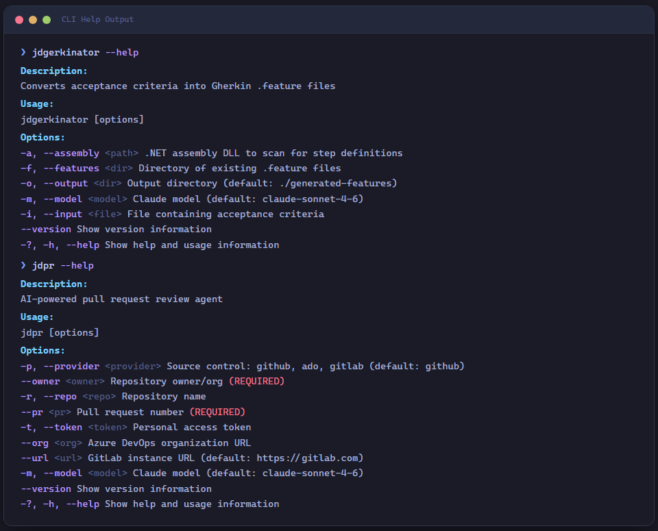

# JD.SemanticKernel.Connectors.ClaudeCode

[](https://www.nuget.org/packages/JD.SemanticKernel.Connectors.ClaudeCode)
[](https://www.nuget.org/packages/JD.SemanticKernel.Connectors.ClaudeCode)
[](https://github.com/JerrettDavis/JD.SemanticKernel.Connectors.ClaudeCode/actions/workflows/ci.yml)
[](https://github.com/JerrettDavis/JD.SemanticKernel.Connectors.ClaudeCode/actions/workflows/codeql-analysis.yml)
[](https://codecov.io/gh/JerrettDavis/JD.SemanticKernel.Connectors.ClaudeCode)
[](LICENSE)

A **Semantic Kernel connector** for Anthropic models with API-key-first authentication and optional local Claude Code OAuth support.

## Features

- **API-key-first authentication** — supports `sk-ant-api*` via options or `ANTHROPIC_API_KEY`
- **Optional local OAuth support** — `sk-ant-oat*` is opt-in and interactive-only
- **Multi-source credential resolution** — options/env API key first, then local OAuth sources
- **Full Semantic Kernel integration** — `IKernelBuilder.UseClaudeCodeChatCompletion()` one-liner
- **DI-friendly** — `IServiceCollection.AddClaudeCodeAuthentication()` for ASP.NET Core / Generic Host
- **Broad TFM support** — `netstandard2.0`, `net8.0`, `net10.0`

## Compliance Defaults

- OAuth token support is **disabled by default**.
- OAuth usage requires `EnableOAuthTokenSupport = true` and an interactive session.
- Unattended or automated OAuth workflows are intentionally blocked.
- For service, CI, or unattended usage, use Anthropic API keys (`sk-ant-api*`).
- Anthropic Consumer Terms (effective October 8, 2025) apply to consumer-service usage:
  <https://www.anthropic.com/legal/consumer-terms>
- Anthropic API keys are governed by Anthropic Commercial Terms:
  <https://www.anthropic.com/legal/commercial-terms>

## Quick Start

### Install

```bash
dotnet add package JD.SemanticKernel.Connectors.ClaudeCode
```

### Kernel Builder (Recommended)

```csharp
using JD.SemanticKernel.Connectors.ClaudeCode;

var builder = Kernel.CreateBuilder();
builder.UseClaudeCodeChatCompletion(apiKey: "sk-ant-api..."); // defaults to ClaudeModels.Default (Sonnet)
var kernel = builder.Build();

var result = await kernel.InvokePromptAsync("Hello, Claude!");
Console.WriteLine(result);
```

### Service Collection (ASP.NET Core)

```csharp
builder.Services.AddClaudeCodeAuthentication(options =>
{
    options.CredentialsPath = "/custom/path/.credentials.json"; // optional
    options.EnableOAuthTokenSupport = true; // only for local interactive OAuth use
});
```

### Configuration Binding

```json
{
  "ClaudeSession": {
    "ApiKey": null,
    "OAuthToken": null,
    "EnableOAuthTokenSupport": false,
    "CredentialsPath": null
  }
}
```

```csharp
builder.Services.AddClaudeCodeAuthentication(builder.Configuration);
```

## Credential Resolution Order

| Priority | Source | Description |
|----------|--------|-------------|
| 1 | `ClaudeSession:ApiKey` | Explicit API key in options/config |
| 2 | `ANTHROPIC_API_KEY` env var | Environment variable |
| 3 | `ClaudeSession:OAuthToken` | Explicit OAuth token (requires `EnableOAuthTokenSupport = true`) |
| 4 | `~/.claude/.credentials.json` | Local Claude Code session (requires `EnableOAuthTokenSupport = true`) |

## Sample CLI Tools



This repo includes sample projects demonstrating agentic workflows with Semantic Kernel:

| Tool | Command | Description |
|------|---------|-------------|
| **Gherkin Generator** | `jdgerkinator` | Converts acceptance criteria into Gherkin/Reqnroll specs |
| **PR Review Agent** | `jdpr` | Multi-provider PR review (GitHub, Azure DevOps, GitLab) |
| **Codebase Explorer** | `jdxplr` | Profiles codebases into structured knowledgebases |
| **Todo Extractor** | *(library demo)* | Extracts structured todos from natural language |

Install the CLI tools as global tools:

```bash
dotnet tool install -g JD.Tools.GherkinGenerator
dotnet tool install -g JD.Tools.PullRequestReviewer
dotnet tool install -g JD.Tools.CodebaseExplorer
```

## Models

Well-known model constants are available via `ClaudeModels`:

```csharp
builder.UseClaudeCodeChatCompletion(ClaudeModels.Opus);   // claude-opus-4-6
builder.UseClaudeCodeChatCompletion(ClaudeModels.Sonnet);  // claude-sonnet-4-6 (default)
builder.UseClaudeCodeChatCompletion(ClaudeModels.Haiku);   // claude-haiku-4-5
```

## Documentation

Full documentation is available at the [DocFX site](docs/) including:

- [Getting Started](docs/articles/getting-started.md)
- [Credential Resolution](docs/articles/credential-resolution.md)
- [Kernel Builder Integration](docs/articles/kernel-builder-integration.md)
- [Service Collection Integration](docs/articles/service-collection-integration.md)
- [HttpClientFactory](docs/articles/http-client-factory.md)
- [Configuration Reference](docs/articles/configuration-reference.md)
- [Sample Tools Guide](docs/samples/index.md)

## Building

```bash
dotnet build
dotnet test
```

### Build Documentation

```bash
cd docs
dotnet tool restore
dotnet docfx docfx.json
```

## Shared Abstractions

This connector implements the **JD.SemanticKernel.Connectors.Abstractions** interfaces,
enabling multi-provider bridging:

| Interface | Implementation |
|---|---|
| `ISessionProvider` | `ClaudeCodeSessionProvider` — credential resolution with `IsAuthenticatedAsync()` |
| `IModelDiscoveryProvider` | `ClaudeModelDiscovery` — returns known Claude model catalogue |
| `SessionOptionsBase` | `ClaudeCodeSessionOptions` — inherits `DangerouslyDisableSslValidation`, `CustomEndpoint` |

Use the same abstractions across providers:

```csharp
ISessionProvider provider = isClaudeCode
    ? claudeCodeProvider
    : copilotProvider;

var creds = await provider.GetCredentialsAsync();
```

### Related Projects

- **[JD.SemanticKernel.Connectors.GitHubCopilot](https://github.com/JerrettDavis/JD.SemanticKernel.Connectors.GitHubCopilot)** — Same pattern for GitHub Copilot subscriptions
- **[JD.SemanticKernel.Extensions](https://github.com/JerrettDavis/JD.SemanticKernel.Extensions)** — SK extensions for skills, hooks, plugins, compaction, and semantic memory

## License

[MIT](LICENSE)
