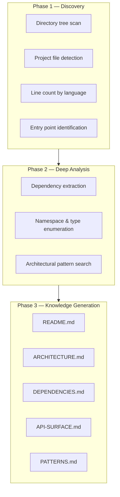

# jdxplr — Codebase Explorer

AI-powered codebase profiler that scans a project directory and generates a
structured **markdown knowledgebase** — ideal for onboarding new developers,
creating architecture documentation, or feeding context into other AI tools.

---

## Quick start

```shell
# Install the tool
dotnet tool install -g JD.Tools.CodebaseExplorer

# Profile the current directory
jdxplr .

# Profile a specific project with custom output
jdxplr C:\git\my-project --output C:\docs\my-project-kb

# Deeper scan with a specific model
jdxplr . --depth 5 --model claude-opus-4-6
```

---

## CLI reference

```
Usage:  jdxplr <path> [options]

Arguments:
  <path>                  Root directory of the codebase to analyze

Options:
  -o, --output <dir>      Output directory for knowledgebase documents
                          (default: <path>/.knowledgebase)
  -m, --model <model>     Claude model (default: claude-sonnet-4-6)
  -d, --depth <depth>     Maximum directory tree depth for scanning (default: 3)
  --version               Show version information
  -?, -h, --help          Show help and usage information
```

---

## How it works



### Phase 1 — Discovery

The agent uses `FileSystemPlugin` to build a map of the codebase:

| Step | Plugin function | Output |
|---|---|---|
| Directory tree | `get_directory_tree` | Hierarchical listing up to `--depth` |
| Project detection | `detect_project_files` | `.csproj`, `package.json`, `Cargo.toml`, etc. |
| Line counts | `count_lines_by_extension` | Lines of code per file extension |
| Entry points | `find_entry_points` | `Program.cs`, `main.py`, `index.ts`, etc. |

### Phase 2 — Deep Analysis

Using `CodeAnalysisPlugin`, the agent drills into each project:

| Step | Plugin function | Output |
|---|---|---|
| .NET dependencies | `analyze_csproj` | Target frameworks, NuGet packages |
| Node dependencies | `analyze_package_json` | npm packages (prod + dev) |
| Namespaces & types | `extract_namespaces_and_types` | Classes, interfaces, enums, records |
| Pattern search | `search_for_patterns` | DI registrations, middleware, handlers |

### Phase 3 — Knowledge Generation

Claude synthesizes findings into five structured documents via `KnowledgeBaseWriterPlugin`:

| Document | Contents |
|---|---|
| **README.md** | Project overview, tech stack, getting started guide |
| **ARCHITECTURE.md** | System design, component relationships, data flow (with mermaid diagrams) |
| **DEPENDENCIES.md** | Complete dependency audit with purpose annotations |
| **API-SURFACE.md** | Public types, interfaces, extension points |
| **PATTERNS.md** | Coding conventions, architectural decisions, observed patterns |

---

## Plugins

### FileSystemPlugin

Safe, read-only file system exploration with built-in exclusions for
`bin/`, `obj/`, `node_modules/`, `.git/`, and other ignored directories.

| Function | Description |
|---|---|
| `get_directory_tree` | Returns indented directory listing with configurable depth |
| `detect_project_files` | Finds project files across 10+ ecosystems (.NET, Node, Python, Java, Rust, Go, Ruby, PHP, Swift, Kotlin) |
| `read_file_content` | Reads a file with size limits and binary detection |
| `count_lines_by_extension` | Aggregates line counts by file extension |
| `find_files_by_pattern` | Searches for files matching a glob-like pattern |

### CodeAnalysisPlugin

Language-aware code analysis focused on .NET and Node.js projects.

| Function | Description |
|---|---|
| `analyze_csproj` | Parses `.csproj` XML for target frameworks, package references, and project references |
| `analyze_package_json` | Parses `package.json` for dependencies, scripts, and metadata |
| `find_entry_points` | Locates application entry points across multiple languages |
| `extract_namespaces_and_types` | Regex-based extraction of C# namespaces, classes, interfaces, enums, and records |
| `search_for_patterns` | Searches for configurable regex patterns across source files |

### KnowledgeBaseWriterPlugin

Markdown document generation and management.

| Function | Description |
|---|---|
| `write_document` | Creates a markdown file in the output directory |
| `append_to_document` | Appends content to an existing document |
| `list_documents` | Lists all documents already written |
| `get_document_template` | Returns a structural template for a given document type |

---

## Output structure

After a successful run, the output directory contains:

```
.knowledgebase/
├── README.md           # Project overview & getting started
├── ARCHITECTURE.md     # System design & component map
├── DEPENDENCIES.md     # Dependency audit
├── API-SURFACE.md      # Public API & extension points
└── PATTERNS.md         # Conventions & decisions
```

Each document uses:
- **Mermaid diagrams** for visual architecture and data flow
- **File path citations** linking to specific source files
- **Tables** for structured data (dependencies, types, patterns)
- **Code snippets** for key examples

---

## Supported ecosystems

The tool detects and analyzes projects across these ecosystems:

| Ecosystem | Project file(s) | Dependency analysis |
|---|---|---|
| .NET | `.csproj`, `.fsproj`, `.vbproj`, `.sln` | ✓ (NuGet packages, project refs, TFMs) |
| Node.js | `package.json` | ✓ (npm dependencies, scripts) |
| Python | `requirements.txt`, `pyproject.toml`, `setup.py` | Detection only |
| Java | `pom.xml`, `build.gradle` | Detection only |
| Rust | `Cargo.toml` | Detection only |
| Go | `go.mod` | Detection only |
| Ruby | `Gemfile` | Detection only |
| PHP | `composer.json` | Detection only |

---

## Examples

### Profile the current repo

```shell
jdxplr . --output ./docs/knowledgebase
```

### Deep scan for a large monorepo

```shell
jdxplr /src/enterprise-app --depth 6 --model claude-opus-4-6
```

### Generate docs for a specific microservice

```shell
jdxplr ./services/payment-api --output ./docs/payment-api-kb --depth 4
```

---

## Architecture

```
CodebaseExplorer/
├── Program.cs                              # CLI entry point (System.CommandLine)
├── Models/
│   ├── CodebaseProfile.cs                  # record(Languages, Frameworks, Projects, TotalLoc)
│   ├── ProjectInfo.cs                      # record(Name, Type, Frameworks, Dependencies, SourceFiles)
│   └── DependencyInfo.cs                   # record(Name, Version, Type, IsDevelopment)
└── Plugins/
    ├── FileSystemPlugin.cs                 # Safe file system exploration
    ├── CodeAnalysisPlugin.cs               # Language-aware code analysis
    └── KnowledgeBaseWriterPlugin.cs        # Markdown document writer
```
