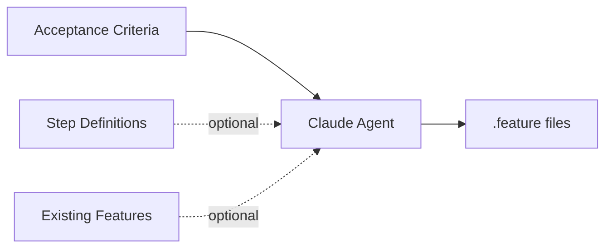

# jdgerkinator — Gherkin Generator

AI-powered tool that converts acceptance criteria into
[Gherkin](https://cucumber.io/docs/gherkin/) `.feature` files, optionally
integrating with existing [Reqnroll](https://reqnroll.net/) /
[SpecFlow](https://specflow.org/) step definitions.

---

## Quick start

```shell
# Install the tool
dotnet tool install -g JD.Tools.GherkinGenerator

# Pipe acceptance criteria from stdin
echo "Users can reset their password via email" | jdgerkinator

# Read criteria from a file
jdgerkinator --input requirements.txt --output ./features

# Scan an assembly for existing step definitions
jdgerkinator --assembly ./bin/Debug/net8.0/MyApp.Tests.dll \
             --features ./features \
             --input requirements.txt
```

---

## CLI reference

```
Usage:  jdgerkinator [options]

Options:
  -a, --assembly <path>   .NET assembly DLL to scan for step definitions
  -f, --features <dir>    Directory of existing .feature files to integrate with
  -o, --output <dir>      Output directory for generated files
                          (default: ./generated-features)
  -m, --model <model>     Claude model (default: claude-sonnet-4-6)
  -i, --input <file>      File containing acceptance criteria
                          (reads from stdin if omitted)
  --version               Show version information
  -?, -h, --help          Show help and usage information
```

---

## How it works



### 1. Input collection

The tool reads acceptance criteria from `--input` or interactively from stdin.
When `--assembly` is provided, the `StepDefinitionScannerPlugin` uses
`System.Reflection.MetadataLoadContext` to inspect the assembly for
`[Given]`, `[When]`, and `[Then]` attributes without loading it into the
runtime.

### 2. Context gathering

If `--features` points to a directory of existing `.feature` files, the
`FeatureFilePlugin` reads them so Claude can integrate new scenarios into
existing features rather than creating duplicates.

### 3. Agentic generation

Claude receives:
- The acceptance criteria text
- Available step definitions (if scanned)
- Existing feature files (if provided)

It then autonomously calls plugin functions to:
1. Scan step definitions (`scan_step_definitions`)
2. List and read existing features (`list_feature_files`, `read_feature_file`)
3. Write new or appended `.feature` files (`write_feature_file`,
   `append_to_feature_file`)

### 4. Output

Generated `.feature` files are written to the output directory, following
standard Gherkin syntax with proper `Feature:`, `Scenario:`, and step keywords.

---

## Plugins

### StepDefinitionScannerPlugin

Scans .NET assemblies for BDD step definitions using reflection-only loading.

| Function | Description |
|---|---|
| `scan_step_definitions` | Loads an assembly via `MetadataLoadContext` and extracts `[Given]`, `[When]`, `[Then]` attributes with their regex patterns, method names, and declaring types |

**Supported attributes:**
- `Reqnroll.GivenAttribute` / `WhenAttribute` / `ThenAttribute`
- `TechTalk.SpecFlow.GivenAttribute` / `WhenAttribute` / `ThenAttribute`

### FeatureFilePlugin

Reads and lists existing `.feature` files for context.

| Function | Description |
|---|---|
| `list_feature_files` | Recursively finds `.feature` files and extracts feature names and tags |
| `read_feature_file` | Returns the full content of a specific feature file |

### GherkinWriterPlugin

Writes generated Gherkin to disk.

| Function | Description |
|---|---|
| `write_feature_file` | Creates a new `.feature` file (creates directories as needed) |
| `append_to_feature_file` | Appends scenarios to an existing `.feature` file |
| `get_feature_template` | Returns a Gherkin template for reference |

---

## Architecture

```
GherkinGenerator/
├── Program.cs                              # CLI entry point (System.CommandLine)
├── Models/
│   ├── StepDefinition.cs                   # record(Keyword, Pattern, MethodName, DeclaringType)
│   └── FeatureFile.cs                      # record(Path, FeatureName, Content, Tags)
└── Plugins/
    ├── StepDefinitionScannerPlugin.cs      # Assembly scanning via MetadataLoadContext
    ├── FeatureFilePlugin.cs                # .feature file reader
    └── GherkinWriterPlugin.cs              # .feature file writer
```

---

## Examples

### Basic — criteria from stdin

```shell
jdgerkinator <<'EOF'
As a user I want to log in with my email and password
so that I can access my account.

Acceptance criteria:
- Valid credentials grant access
- Invalid password shows an error
- Account locked after 5 failed attempts
EOF
```

### With assembly scanning

```shell
jdgerkinator \
  --assembly ./tests/MyApp.AcceptanceTests/bin/Debug/net8.0/MyApp.AcceptanceTests.dll \
  --features ./tests/MyApp.AcceptanceTests/Features \
  --output ./tests/MyApp.AcceptanceTests/Features \
  --input ./docs/sprint-42-criteria.txt
```

This scans the test assembly for step definitions, reads existing features, and
generates new `.feature` files that reuse existing steps where possible.

### Custom model

```shell
jdgerkinator --model claude-opus-4-6 --input complex-requirements.txt
```
