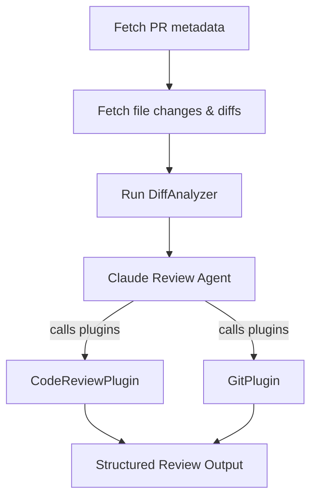

# jdpr — Pull Request Review Agent

AI-powered pull request review agent with an extensible provider architecture
supporting **GitHub**, **Azure DevOps**, and **GitLab**. The agent fetches PR
metadata and diffs, runs static analyzers, then conducts a structured code
review via Claude.

---

## Quick start

```shell
# Install the tool
dotnet tool install -g JD.Tools.PullRequestReviewer

# Review a GitHub PR (uses GITHUB_TOKEN env var)
jdpr --owner myorg --repo myapp --pr 42

# Review an Azure DevOps PR
jdpr --provider ado --owner myproject --repo myapp --pr 123 \
     --org https://dev.azure.com/myorg --token $AZURE_DEVOPS_PAT

# Review a GitLab merge request
jdpr --provider gitlab --owner mygroup/myproject --pr 56

# Self-hosted GitLab
jdpr --provider gitlab --owner mygroup/myproject --pr 56 \
     --url https://gitlab.internal.com --token $GITLAB_TOKEN
```

---

## CLI reference

```
Usage:  jdpr [options]

Options:
  -p, --provider <provider>   Source control provider: github, ado, gitlab
                              (default: github)
  --owner <owner>             Repository owner/org (REQUIRED)
                              GitHub: owner, ADO: project name, GitLab: namespace/project
  -r, --repo <repo>           Repository name (not required for GitLab)
  --pr <pr>                   Pull request / merge request number (REQUIRED)
  -t, --token <token>         Personal access token
                              (or set GITHUB_TOKEN / AZURE_DEVOPS_PAT / GITLAB_TOKEN)
  --org <org>                 Azure DevOps organization URL
  --url <url>                 GitLab instance URL (default: https://gitlab.com)
  -m, --model <model>         Claude model (default: claude-sonnet-4-6)
  --version                   Show version information
  -?, -h, --help              Show help and usage information
```

---

## How it works



### Phase 1 — Data collection

The tool connects to the selected provider, fetches the PR metadata
(`PullRequestInfo`) and all changed files with their diffs (`FileChange[]`).

### Phase 2 — Automated analysis

The `DiffAnalyzer` runs pattern-based checks on every diff:

| Check | Description |
|---|---|
| **Secret detection** | Scans for passwords, API keys, AWS credentials, connection strings |
| **Large file detection** | Flags files over 500 lines of changes |
| **High churn detection** | Flags files where over 70% of lines changed |
| **TODO/HACK comments** | Identifies unresolved work markers |
| **Test file deletion** | Warns when test files are removed |

### Phase 3 — AI review

Claude receives the full PR context via plugins and conducts a structured
review, examining each file for:
- Logic errors and bugs
- Security vulnerabilities
- Performance issues
- Code style and maintainability concerns
- Missing error handling or edge cases

The agent records findings as `ReviewComment` objects with severity levels,
categories, line numbers, and optional fix suggestions.

### Phase 4 — Output

The review summary includes:
- Overall verdict (`Approve`, `RequestChanges`, or `Comment`)
- File-by-file comments with severity and line references
- Aggregate statistics (files reviewed, issues found by severity)

---

## Providers

### GitHub

Uses [Octokit](https://github.com/octokit/octokit.net) to fetch PR data.

**Authentication:** Set `GITHUB_TOKEN` environment variable or pass `--token`.

```shell
export GITHUB_TOKEN=ghp_xxxxxxxxxxxx
jdpr --owner microsoft --repo semantic-kernel --pr 1234
```

### Azure DevOps

Uses the Azure DevOps REST API v7.1 with PAT authentication.

**Authentication:** Set `AZURE_DEVOPS_PAT` environment variable or pass `--token`.

```shell
jdpr --provider ado \
     --org https://dev.azure.com/myorg \
     --owner MyProject \
     --repo MyRepo \
     --pr 567 \
     --token $AZURE_DEVOPS_PAT
```

**Required PAT scopes:** `Code (Read)`

### GitLab

Uses the GitLab REST API v4 with Private-Token authentication. Supports
self-hosted instances via `--url`.

**Authentication:** Set `GITLAB_TOKEN` environment variable or pass `--token`.

```shell
# gitlab.com
jdpr --provider gitlab --owner mygroup/myproject --pr 89

# Self-hosted
jdpr --provider gitlab \
     --owner mygroup/myproject \
     --pr 89 \
     --url https://gitlab.internal.com \
     --token $GITLAB_TOKEN
```

**Required token scopes:** `read_api`

---

## Plugins

### CodeReviewPlugin

The primary review workflow plugin, exposed as kernel functions to Claude.

| Function | Description |
|---|---|
| `get_pr_summary` | Returns PR title, description, author, branch info, and file count |
| `list_changed_files` | Lists all changed files with change type and diff size |
| `get_file_diff` | Returns the full diff for a specific file |
| `get_analyzer_findings` | Returns automated analysis results from `DiffAnalyzer` |
| `add_review_comment` | Records a review comment with severity, category, and optional fix suggestion |
| `get_review_summary` | Aggregates all comments and returns the final review verdict |

### GitPlugin

Git CLI integration for deeper repository exploration.

| Function | Description |
|---|---|
| `clone_repository` | Clones a repository to a temporary directory |
| `get_branch_diff` | Runs `git diff` between source and target branches |
| `read_file_at_branch` | Reads a file at a specific branch ref via `git show` |
| `get_commit_log` | Returns formatted commit log for a branch range |

---

## Extensibility

### Adding a new provider

Implement the `IPullRequestProvider` interface:

```csharp
public interface IPullRequestProvider
{
    Task<PullRequestInfo> GetPullRequestAsync(string owner, string repo, int prNumber);
    Task<IReadOnlyList<FileChange>> GetFileChangesAsync(string owner, string repo, int prNumber);
}
```

Then register it in `Program.cs` alongside the existing providers.

### Adding a new analyzer

Implement the `IAnalyzer` interface:

```csharp
public interface IAnalyzer
{
    string Name { get; }
    Task<AnalyzerResult> AnalyzeAsync(
        PullRequestInfo pr,
        IReadOnlyList<FileChange> files);
}
```

### Review severity levels

| Level | Meaning |
|---|---|
| `Critical` | Must fix before merge — bugs, security issues |
| `Warning` | Should fix — code smells, missing validation |
| `Suggestion` | Nice to have — style, readability improvements |
| `Nitpick` | Minor — formatting, naming preferences |

---

## Architecture

```
PullRequestReviewer/
├── Program.cs                                      # CLI entry (System.CommandLine)
├── Abstractions/
│   ├── IPullRequestProvider.cs                     # Provider extensibility interface
│   ├── IAnalyzer.cs                                # Analyzer interface + result types
│   ├── PullRequestInfo.cs                          # PR metadata record
│   ├── FileChange.cs                               # File change record + ChangeType enum
│   ├── ReviewComment.cs                            # Comment record + ReviewSeverity enum
│   └── ReviewResult.cs                             # Result record + ReviewVerdict enum
├── Providers/
│   ├── GitHub/
│   │   └── GitHubPullRequestProvider.cs            # Octokit-based implementation
│   ├── AzureDevOps/
│   │   └── AzureDevOpsPullRequestProvider.cs       # REST API v7.1 implementation
│   └── GitLab/
│       └── GitLabPullRequestProvider.cs            # REST API v4 implementation
├── Analyzers/
│   └── DiffAnalyzer.cs                             # Pattern-based diff analysis
└── Plugins/
    ├── CodeReviewPlugin.cs                         # Review workflow SK plugin
    └── GitPlugin.cs                                # Git CLI SK plugin
```
